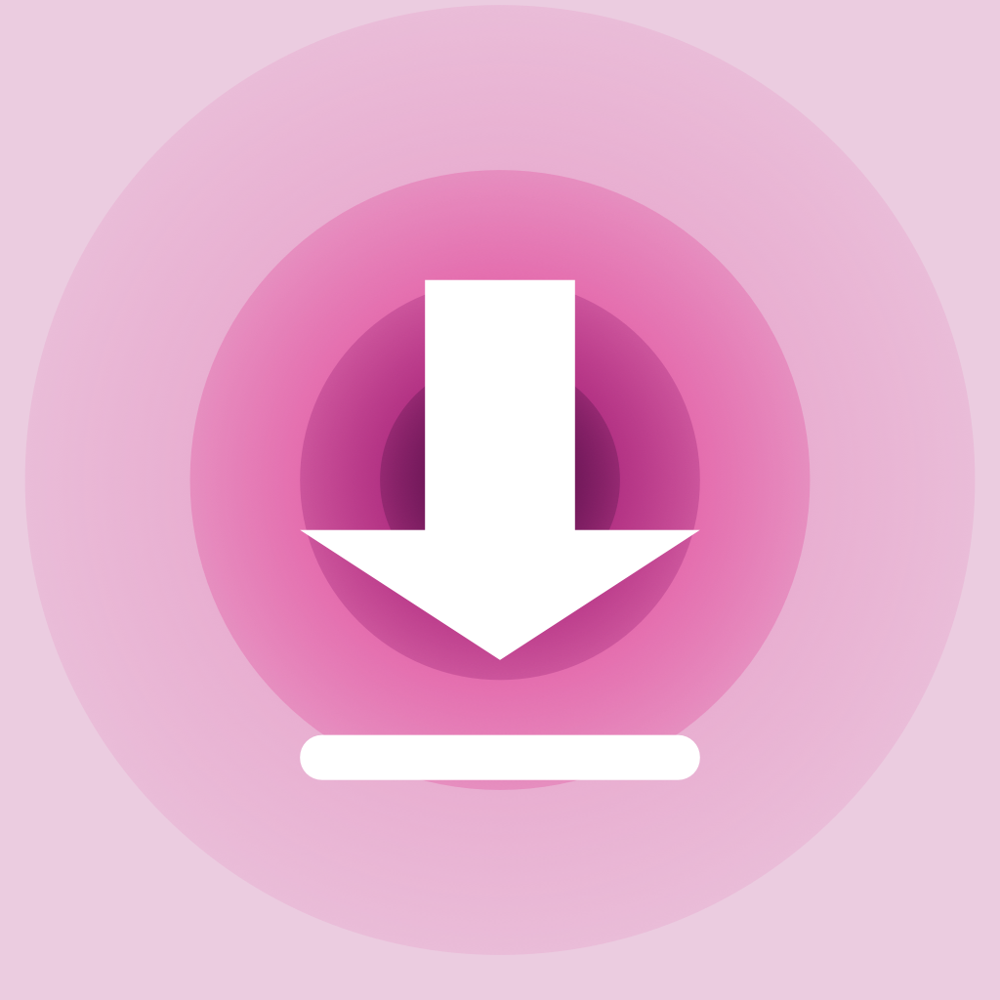

<p align="center">
  
</p>

<h1 align="center">Savo для macOS</h1>

<p align="center">
  Нативное приложение macOS для скачивания своих видео с YouTube:
  вставил ссылку, выбрал качество, получил файл.
</p>

<p align="center">
  <a href="README.md">English</a> · <b>Русский</b>
</p>

<p align="center">
  
  
  
</p>

Savo сделано под одну задачу: сохранять видео со своего YouTube-канала — включая
открытые эфиры и эфиры «по ссылке» — без терминала. Движок загрузки (yt-dlp с ffmpeg
и deno) лежит внутри приложения, ставить ничего через Homebrew или Python не нужно.

Интерфейс локализован на русский и английский; код и комментарии — на русском.

## Возможности

- **Вставил ссылку** — появляется карточка с обложкой, названием, каналом и
  длительностью. Подхват ссылки из буфера обмена при переключении на Savo —
  по желанию (по умолчанию выключен).
- **Три вида загрузки** — «Видео» (MP4 со звуком), «Аудио» (оригинальный M4A или MP3
  320/192/128 кбит/с) и «Без звука» (только видеодорожка). Показываются только те
  качества, что реально есть у ролика, с примерным размером файла.
- **Качество называется так, как у YouTube** — 2160p … 360p, в том числе у роликов
  не 16:9 и вертикальных (кадр 3840×1920 — это «2160p», а не «1920p»). Селектор
  формата строгий: если YouTube не отдаёт выбранное качество, Savo честно об этом
  скажет, а не скачает молча качество ниже.
- **Открывается в QuickTime** — по умолчанию выбирается самый высокий вариант
  в H.264; качества, которые есть только в VP9/AV1, помечены.
- **Понятные имена файлов** — `Название [28.09.2026, 1080p].mp4`: дата публикации
  различает одноимённые эфиры, а разные качества одного ролика не затирают друг друга.
- **Прогресс** со скоростью, остатком времени и этапами (видео → звук → сведение).
  Отмена подчищает временные файлы; недокачанные огрызки в «Загрузки» не попадают.
- **История** последних загрузок с «Показать в Finder»; переживает перезапуск, а
  битая запись отбрасывается поштучно, не обнуляя всю историю.
- **Движок не устаревает** — раз в сутки Savo проверяет новую версию yt-dlp на
  GitHub, сверяет SHA-256 и подменяет её атомарно, никогда посреди загрузки.
  «Обновить движок» в настройках делает то же по кнопке.
- **Понятные ошибки** — при отказе YouTube (403, «не робот», нет формата) Savo сначала
  пробует другой клиент; на лимит запросов и приватные видео — свои сообщения.
- **Диагностика** — «Скопировать отчёт» в настройках (версии, модель Mac, скорость
  старта движка, последние загрузки, хвост журнала) и журнал движка
  `~/Library/Logs/Savo/engine.log`.
- **Современный вид macOS** — Liquid Glass на macOS 26/27, материал на 14/15, светлая
  и тёмная темы, учёт «Уменьшить движение» и «Уменьшить прозрачность».

## Требования

- Mac на Apple Silicon (M1 и новее), macOS 14 Sonoma или новее. Intel не
  поддерживается.
- Для сборки: Xcode с SDK macOS 26 или новее (современный вид системы зависит от SDK,
  с которым собрано приложение) и интернет для загрузки движка.

## Сборка

```bash
cd Savo-app
scripts/fetch-binaries.sh   # yt-dlp (onedir), ffmpeg, deno → Vendor/bin (не в git)
./build.sh                  # сборка arm64, подпись, установка в ~/Applications
./build.sh --zip            # то же плюс Savo.zip для второго Mac
./run.sh                    # сборка и запуск
```

- `fetch-binaries.sh` сверяет архив yt-dlp с `SHA2-256SUMS` релиза и проверяет, что у
  каждого бинарника есть arm64. Закрепить версию yt-dlp:
  `YTDLP_TAG=2026.08.19 scripts/fetch-binaries.sh`.
- Подпись — локальным сертификатом «Savo Dev», если он есть
  (`scripts/make-dev-cert.md`), иначе ad-hoc. На другом Mac первый запуск — правый
  клик → «Открыть» (или Системные настройки → Конфиденциальность и безопасность →
  «Открыть всё равно»).
- `build.sh` собирает бандл в `/tmp` (папки Рабочего стола в iCloud навешивают
  расширенные атрибуты, и `codesign` падает) и переписывает версию SDK в
  `LC_BUILD_VERSION` бинарника: SwiftPM пишет туда минимальную версию системы, и
  macOS выдала бы приложению старый вид контролов.

## Как устроено

- **AppKit-каркас, контент на SwiftUI.** `DownloadController` — небольшой конечный
  автомат: ожидание → получение информации → выбор качества → загрузка → готово /
  ошибка.
- **Движок.** В бандле yt-dlp лежит onedir-архивом релиза. При первом запуске он
  распаковывается в `~/Library/Application Support/Savo/bin`, проходит проверочный
  запуск и дальше работает оттуда — onedir стартует за ~0,2 с, onefile тратил ~7 с на
  каждый запуск. Обновление подменяет папку целиком одним атомарным rename. Все
  внешние процессы запускаются только через `ProcessRunner`.
- **Раскладка** (`Savo-app/Sources/Savo`):
  - `Engine/` — установщик, апдейтер, запуск процессов, клиент yt-dlp, разбор
    прогресса, ошибки, журнал движка;
  - `Model/` — проверка ссылок, сведения о видео, пресеты качества (чистая логика);
  - `Controllers/` — конечный автомат загрузки;
  - `Storage/` — история и настройки;
  - `Diagnostics/` — отчёт для отладки;
  - `UI/` — окна и вью, `UI/DesignSystem/` — дизайн-токены, стекло, кнопки.

Заметки для разработки и ловушки, на которые мы уже наступали, — в
[`CLAUDE.md`](CLAUDE.md).

## Сторонние компоненты

Скачиваются `scripts/fetch-binaries.sh` при сборке и вкладываются в приложение;
в репозитории не хранятся.

- [yt-dlp](https://github.com/yt-dlp/yt-dlp) — Unlicense (общественное достояние).
- [FFmpeg](https://ffmpeg.org) — статические сборки
  [ffmpeg.martin-riedl.de](https://ffmpeg.martin-riedl.de); LGPL/GPL в зависимости от
  конфигурации сборки.
- [Deno](https://deno.com) — MIT.

## Ответственное использование

Savo предназначено для контента, который принадлежит вам или который вам разрешено
скачивать, — например, для своего канала. Соблюдайте условия использования YouTube
и авторское право.

## Лицензия

[GPL-3.0](LICENSE).
